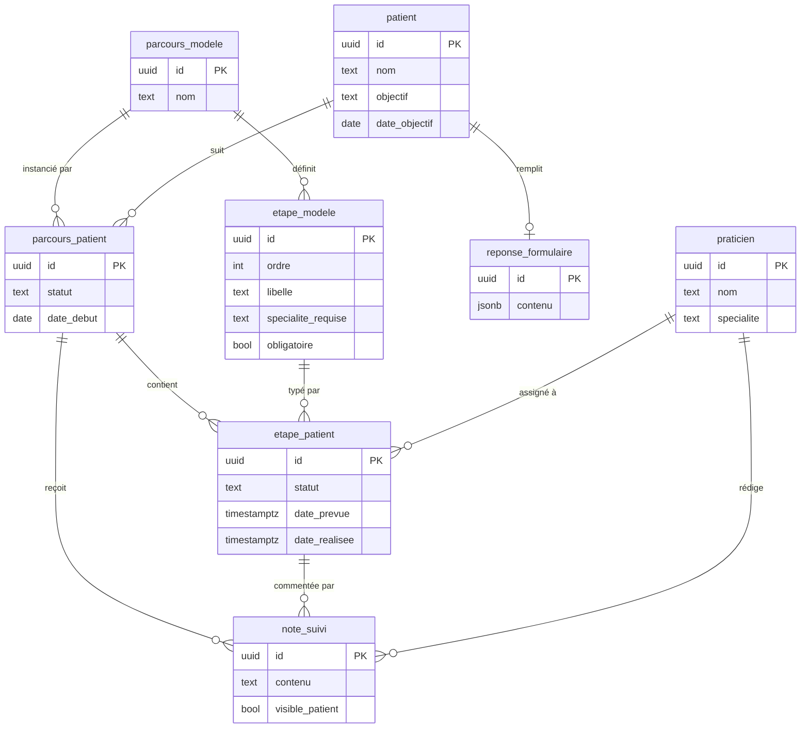

# Via Sana — suivi des parcours de soins coordonnés

Prototype d'un outil de suivi des parcours de soins, construit autour du parcours
**Prépa Marathon**. Trois vues : praticien, coordinateur, patient.

Les choix de conception et leurs contreparties sont documentés dans **[DECISIONS.md](DECISIONS.md)**.

---

## Lancer le projet

```bash
npm install
npm run dev     # http://localhost:5174
npm test        # 12 tests sur les règles de détection
npm run build   # production dans dist/
```

L'application démarre avec un jeu de démonstration en mémoire, sans compte ni service
externe. Le premier écran demande qui vous êtes : un praticien, la coordinatrice Nadia
Kessler, ou un patient.

### Brancher sur Supabase

1. Créer un projet Supabase.
2. Exécuter dans l'ordre `supabase/schema.sql`, `supabase/seed.sql`, `supabase/policies.sql`.
3. Copier `.env.example` vers `.env` et renseigner les deux variables.
4. Relancer `npm run dev`.

L'en-tête indique la source utilisée, `données de démonstration` ou `Supabase`.

Les fichiers SQL peuvent aussi être appliqués en ligne de commande, en renseignant
`DATABASE_URL` dans un `.env.local` non versionné :

```bash
npm run db:apply supabase/schema.sql supabase/seed.sql supabase/policies.sql
```

---

## Modèle de données



Un parcours est décrit une fois dans `parcours_modele` et `etape_modele`, puis instancié pour
chaque patient dans `parcours_patient` et `etape_patient`. Les étapes sont donc des données :
ajouter un parcours ne demande ni migration ni modification de code.

---

## Ce que fait le prototype

**Praticien**

- sa file de patients par défaut, avec bascule vers l'ensemble
- filtres par parcours, statut et étape courante, plus une recherche
- fiche patient : identité, objectif, réponses du questionnaire, praticiens impliqués, frise
  des étapes, prochaines séances, notes
- changement de statut d'une étape
- ajout d'une note, rattachée au parcours ou à une étape, interne ou partagée avec le patient

**Coordinateur**

- onglet « Points à traiter » : les parcours qui n'avancent pas, classés par urgence
- cinq règles de détection : questionnaire jamais transmis, étape en cours sans date, étape en
  cours sans praticien alors qu'une spécialité est attendue, parcours sans activité depuis
  trois semaines, parcours en pause
- onglet « Tous les patients » pour l'accès complet
- assignation d'un praticien et planification d'une date, réservées à ce rôle

**Patient**

- accès à son seul dossier
- questionnaire préalable à remplir ou consulter
- parcours en lecture seule, étapes réalisées, en cours et à venir
- prochaines séances et notes qui lui sont destinées

Transmettre le questionnaire clôture la première étape et fait passer la suivante en cours.
C'est le seul automatisme, et il correspond au parcours réel : le questionnaire est lu par le
kiné avant le bilan.

---

## Architecture

```
src/
  types.ts                     le modèle métier, partagé
  data/
    repository.ts              le contrat d'accès aux données
    mockRepository.ts          implémentation en mémoire
    supabaseRepository.ts      implémentation Supabase
    index.ts                   choisit l'une ou l'autre
    seed.ts                    jeu de démonstration
    alertes.ts                 règles de détection, fonction pure
    alertes.test.ts            12 tests
  pages/
    Connexion.tsx              choix du profil
    ListePraticien.tsx         liste et filtres
    TableauCoordination.tsx    points à traiter
    FicheParcours.tsx          fiche, réutilisée en lecture seule côté patient
    EspacePatient.tsx          espace patient et questionnaire
  components/ui.tsx            badges, progression, formats de date
supabase/
  schema.sql                   tables et parcours Prépa Marathon
  seed.sql                     six patients de démonstration
  policies.sql                 politiques de sécurité au niveau des lignes
  migrations/                  évolutions du schéma
```

Les écrans ne connaissent que l'interface `Repository`. La vue patient réutilise le composant
de la vue praticien en lecture seule, ce qui garantit que les deux affichent le même parcours.
L'application est utilisable sur téléphone.

---

## Démonstration guidée

Cinq minutes, dans cet ordre.

1. **Se connecter en coordinateur, Nadia Kessler.** Quatre blocages, deux points de vigilance,
   trois parcours sains. Karim Dubois cumule quatre alertes.
2. **Ouvrir sa fiche.** Assigner Camille Renaud au bilan clinique et poser une date, puis
   revenir au tableau : deux alertes ont disparu.
3. **Filtrer sur « Tous les parcours ».** Le second parcours a été ajouté sans toucher au
   schéma ni au code.
4. **Se connecter en Camille Renaud.** Elle voit cinq patients sur six, Karim n'ayant aucun
   praticien assigné. Elle peut noter, pas assigner.
5. **Se connecter en Karim Dubois.** Son questionnaire est vide. Le remplir clôture l'étape 1.
   Il ne voit pas la note interne qui le concerne.
6. **Réduire la fenêtre à la largeur d'un téléphone.**

---

## Limites connues

- L'identification n'est pas une authentification : pas de mot de passe, filtrage appliqué par
  l'interface.
- Pas de prise de rendez-vous, pas de notifications, pas d'historique des modifications.
- Une trentaine de requêtes à l'ouverture en mode Supabase.
- Sur un produit réel, il faudrait traiter l'hébergement de données de santé, la traçabilité
  des accès et la durée de conservation.

Le détail de ces limites et des arbitrages est dans [DECISIONS.md](DECISIONS.md).

---

## Ce que je ferais ensuite

1. L'authentification, avec le cloisonnement appliqué par la base.
2. Une URL par fiche, pour en partager une en réunion.
3. Le rattachement d'un document à une étape, le partage documentaire étant au cœur de la
   coordination.
4. Des tests sur le calcul d'avancement, aujourd'hui dupliqué entre les deux implémentations.
